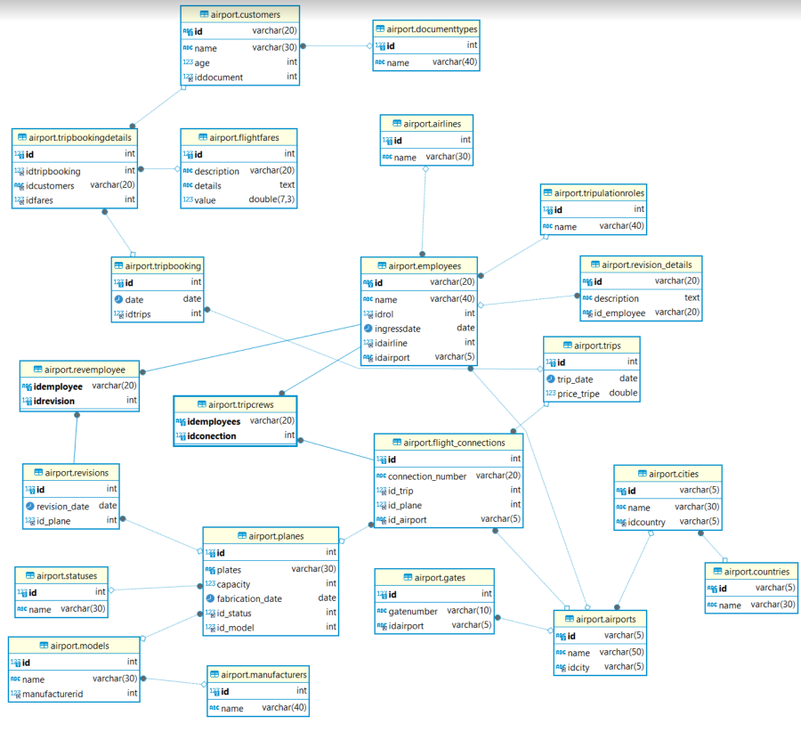
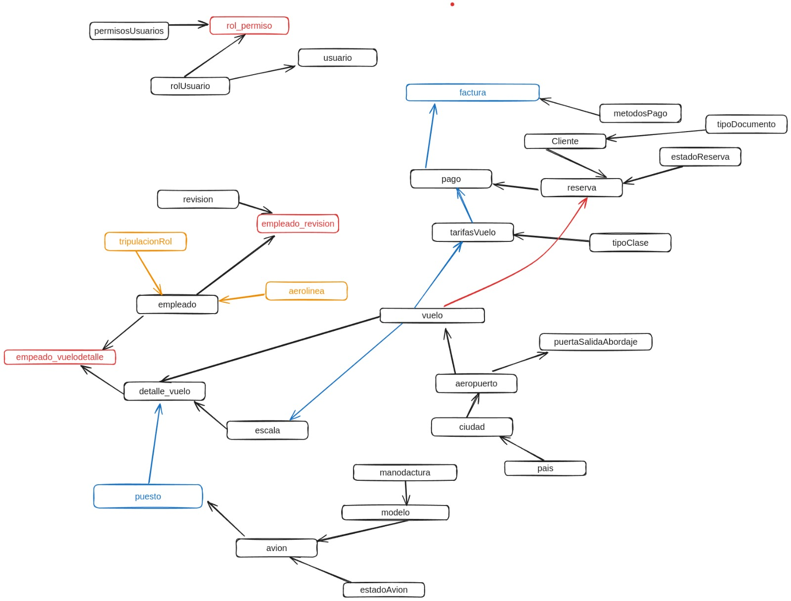

# Vuelos Globales (Creación de un sistema gestor para una aerolinea)

Vuelos Globales opera vuelos a nivel internacional y cuenta con una flota de aviones, tripulación
variada, múltiples aerolíneas asociadas y una vasta red de aeropuertos y ciudades de destino. La
empresa requiere una base de datos robusta para gestionar todos los aspectos de su operación,
desde la reserva de vuelos hasta el mantenimiento de los aviones y la administración de la
tripulación.

## Modelo relacional proporcionado.



## Modelo relacional remasterizado.



## Shedule

### Definicion de entidades/servicios.

### Crear paquete de acceso como usuario.
    pendiente: Generar vista para cada rol (para poder usar eventos de JPane)
    
### Montar estructura del proyecto aplicacion hexagonal y vertical slice.

### Registrar conexiones de cada entidad a la espera de ser llamadas.


```java
//ACCESO A VISTA PRINCIPAL SIN PANE
    boolean salir = false;
    while (!salir) {
        System.out.println("\n");
        System.out.println("========================");
        System.out.println("   Hight all the time");
        System.out.println("________________________");
        System.out.println("1. Ingresar");
        System.out.println("2. Acceder Como Cliente");
        System.out.println("3. Salir");
        System.out.println("========================");
        System.out.print("Elige una opción: ");
        Scanner scanner = new Scanner(System.in);
        try {


        } catch (Exception e) {
            System.out.println("Ha ocurrido un error inesperado: " + e);
        }
    }

//ACCESO A VISTA DE USUARIO SIN PANE
int opcion = Integer.parseInt(scanner.nextLine());

switch (opcion) {
    case 1:
        try {
            System.out.print("-> Usuario: ");
            String usuario = scanner.nextLine();
            System.out.print("-> Contraseña: ");
            String contraseña = scanner.nextLine();
            User usuarioValidado = userUseCase.consultarUser(usuario, contraseña);
            if (usuarioValidado != null) {
                boolean salir2 = false;
                while (!salir2) {
                    List<String> permisos = userUseCase.obtenerPermisosUserCase(usuarioValidado.getId_rolUsuario());
                    int acumulador = 1;

                    System.out.println("\n");
                    System.out.println("===============================");
                    System.out.println(MessageFormat.format("   Gestiones {0} ", usuarioValidado.getId_rolUsuario()));
                    System.out.println("_______________________________");

                    for (String string : permisos) {
                        System.out.println(MessageFormat.format("{0}. {1}", acumulador, string.toLowerCase()));
                        acumulador++;
                    }
                    System.out.println("00. Salir");
                    System.out.println("===============================");
                    System.out.print("Elige una opción: ");
                    try {
                        int opcion2 = Integer.parseInt(scanner.nextLine());

                        switch (opcion2) {
                            case 00:
                                System.out.println("Saliendo...");
                                salir2 = true;
                                break;

                            default:
                                break;
                        }
                    } catch (Exception e) {
                        // TODO: handle exception
                    }
                }

            } else {
                System.out.println("@@@@@@@@@@@@@@@@@@@@@@@@@@@@@@@@@@@@@@@@@");
                System.out.println("Datos incorrectos, usuario no encontrado.");
                System.out.println("@@@@@@@@@@@@@@@@@@@@@@@@@@@@@@@@@@@@@@@@@");
            }
        } catch (Exception e) {
            System.out.println("Ha ocurrido un error inesperado: " + e);
        }

        break;

    case 2:
        // Instanciar a vista de CLIENTE
        System.out.println("Access successfully!");
        break;

    case 3:
        System.out.println("Saliendo...");
        salir = true;
        break;

    default:
        System.out.println("Opción no válida, por favor elige una opción entre 1 y 4");
}
```
